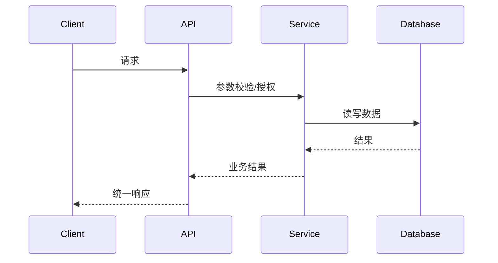
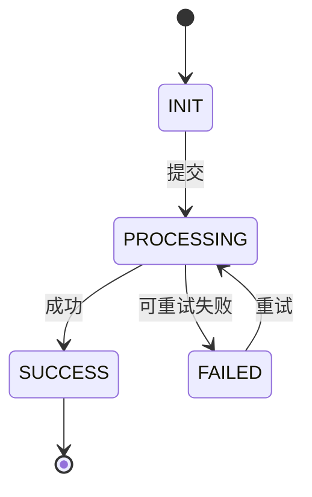

# [系统/项目名称] 详细设计

> 用途：将已批准的概要架构转化为可编码、可联调、可迁移、可测试的实现方案。
>
> 前置条件：概要架构状态为 `approved`，或评审结论明确允许并行进入详细设计。

## 0. 文档控制与追溯

| 项目 | 内容 |
|---|---|
| 文档状态 | draft / in_review / approved / deprecated |
| 文档版本 | v[主版本].[次版本] |
| 文档负责人 |  |
| 关联概要架构 | [链接及版本] |
| 关联需求 |  |
| 目标模块 | M-001、M-002 |
| 关联 ADR | ADR-001 |
| API diff | 无 / [链接] |

### 0.1 设计结论

状态：`pass` / `pass_with_followups` / `blocked`

- 关键设计决策：
- 阻塞问题：
- 必须补充项：

> ⚠️ **变更回写检查**：若本详细设计改变了概要架构中的系统边界、核心技术选型或一致性模型，必须先更新概要架构并新增 ADR，否则本文档不可进入 `approved` 状态。

### 0.2 变更记录

| 版本 | 日期 | 修改人 | 修改内容 | 评审结论 |
|---|---|---|---|---|
| v0.1 |  |  | 初稿 |  |

## 1. 设计范围与复用分析

### 1.1 In Scope / Out of Scope

#### In Scope

- 

#### Out of Scope

- 

### 1.2 复用、扩展、替换、新增

| 点位 | 类型 | 现状 | 设计处理 | 影响文件/模块 |
|---|---|---|---|---|
|  | 复用/扩展/替换/新增 |  |  |  |

### 1.3 约束、假设与未决问题

| 类型 | 内容 | 验证人/截止时间 |
|---|---|---|
| Constraint |  |  |
| Assumption |  |  |
| Open Question |  |  |

## 2. 模块与类级设计

### 2.1 模块职责

| 模块编号 | 模块 | 输入 | 输出 | 依赖 | 事务边界 |
|---|---|---|---|---|---|
| M-001 |  |  |  |  |  |

### 2.2 分层对象

| 对象类型 | 命名/位置约定 | 职责 | 备注 |
|---|---|---|---|
| Controller/Handler |  |  |  |
| DTO/Command |  |  |  |
| VO/Response |  |  |  |
| Entity/Aggregate |  |  |  |
| Repository/Mapper |  |  |  |
| Service/Biz |  |  |  |
| Event Handler |  |  |  |

### 2.3 依赖与调用规则

[说明允许依赖、禁止反向依赖、跨模块调用和公共能力复用规则。]

## 3. 接口与事件契约

### 3.1 外部 HTTP API

| 编号 | 方法/路径 | 用途 | 鉴权 | 幂等键 | 版本 |
|---|---|---|---|---|---|
| API-001 | GET/POST |  |  |  | v1 |

#### 请求/响应字段

| 字段 | 类型 | 必填 | 校验/枚举 | 脱敏 | 说明 |
|---|---|---:|---|---|---|
|  |  |  |  |  |  |

#### 统一响应与错误码

```json
{
  "code": "200",
  "message": "",
  "data": {},
  "status": "success",
  "requestId": ""
}
```

| 错误码 | HTTP 状态 | 触发条件 | 客户端处理 | 是否可重试 |
|---|---:|---|---|---:|
|  |  |  |  |  |

### 3.2 内部 RPC/Interface

| 接口 | 调用方 | 提供方 | 超时 | 重试 | 熔断/降级 |
|---|---|---|---:|---|---|
|  |  |  |  |  |  |

### 3.3 MQ/领域事件

| 事件编号 | Topic/名称 | 发布方 | 消费方 | Schema 版本 | 投递语义 |
|---|---|---|---|---|---|
| EVT-001 |  |  |  | v1 | 至少一次/至多一次 |

### 3.4 文件导入导出契约

| 文件/格式 | 版本 | 字段/列规则 | 大小限制 | 失败处理 | 兼容策略 |
|---|---|---|---:|---|---|
|  |  |  |  |  |  |

> 任何新增或修改的外部 HTTP、RPC、事件或文件契约，必须同步维护 `API-Diff模板.yaml` 的实例文件。

## 4. 数据详细设计

### 4.1 表结构

| 表名 | 用途 | 主键 | 唯一键 | 索引 | 分库分表 |
|---|---|---|---|---|---|
|  |  |  |  |  |  |

### 4.2 字段定义

| 表 | 字段 | 类型 | 非空 | 默认值 | 敏感级别 | 说明 |
|---|---|---|---:|---|---|---|
|  |  |  |  |  |  |  |

### 4.3 数据生命周期与治理

- 归档条件和目标存储：
- 清理条件、逻辑/物理删除：
- 备份策略与恢复验证：
- 数据质量规则和对账：
- Schema 演进与兼容窗口：

### 4.4 缓存设计

| Key 模式 | Value | TTL | 一致性策略 | 失效方式 | 热点/击穿保护 |
|---|---|---:|---|---|---|
|  |  |  |  |  |  |

## 5. 核心流程与运行时行为

### 5.1 时序图



### 5.2 状态机



### 5.3 事务与一致性

| 场景 | 事务边界 | 一致性模型 | 失败补偿 | 对账方式 |
|---|---|---|---|---|
|  | 本地事务/最终一致性 |  |  |  |

### 5.4 幂等、并发与锁

- 幂等键生成和保存：
- 重复消息处理：
- 并发控制/分布式锁：
- 超时、重试和死信：
- 限流和背压：

## 6. 异常、安全与可观测性实现

### 6.1 异常处理

| 异常类型 | 捕获层 | 错误码 | 日志级别 | 告警 | 客户端处理 |
|---|---|---|---|---|---|
|  |  |  |  |  |  |

### 6.2 安全实现

- 权限校验点和数据权限过滤：
- 输入校验、SQL 注入、XSS、文件上传防护：
- 敏感字段加密/脱敏：
- 审计事件和留存期限：
- 密钥/证书轮换：

### 6.3 可观测性实现

| 信号 | 埋点位置 | 字段/标签 | 采样策略 | 告警阈值 |
|---|---|---|---|---|
| 日志 |  | requestId、traceId、业务主键 |  |  |
| 指标 |  | QPS、P95、错误率、积压量 |  |  |
| 链路 |  | Span/上下游关系 |  |  |

## 7. 部署、配置与资源

### 7.1 服务实例与资源规格

| 服务 | 实例数 | CPU/内存 | 副本策略 | 扩缩容指标 | 健康检查 |
|---|---:|---|---|---|---|
|  |  |  |  |  |  |

### 7.2 配置与密钥

| 配置项 | 来源 | 环境差异 | 是否敏感 | 变更方式 |
|---|---|---|---:|---|
|  |  |  |  |  |

### 7.3 发布与回滚

- 发布批次/灰度规则：
- 数据库变更兼容窗口：
- 回滚条件和步骤：
- 运行手册/值班人：

## 8. 数据迁移与兼容

| 迁移对象 | 规模 | 迁移方式 | 校验/对账 | 回滚 | 窗口 |
|---|---:|---|---|---|---|
|  |  |  |  |  |  |

## 9. 测试与架构验证

| 验证项 | 场景 | 指标/通过标准 | 工具/环境 | 负责人 |
|---|---|---|---|---|
| 接口契约 |  |  |  |  |
| 性能容量 |  |  |  |  |
| 故障恢复 |  |  |  |  |
| 安全 |  |  |  |  |

## 10. API Diff 与契约锁定

- `contract_lock_status`：`locked` / `followups` / `blocked`
- API diff 文件：[链接]
- 兼容性结论：
- 必须补齐的字段/规则：

> **API-Diff 文件规范**：统一存放于 `api-diffs/{模块编号}/{API编号}_v{版本号}_diff.yaml`。
>
> 示例：`api-diffs/M-001/API-001_v1.2_diff.yaml`
>
> 若同一详细设计涉及多个接口，应分别建立 API-Diff 文件，并在本节逐项列出链接；若无外部契约变化，填写“本次无需 API diff”。

## 11. 影响文件、风险与下一步

### 11.1 影响文件

| 文件/目录 | 变更类型 | 说明 |
|---|---|---|
|  | 新增/修改/删除 |  |

### 11.2 Risks

- 

### 11.3 Open Questions

1. 

### 11.4 Next Step

- [ ] 拆分开发任务
- [ ] 锁定 API diff/事件 Schema
- [ ] 生成数据库迁移脚本
- [ ] 补充测试设计
- [ ] 进入开发和联调
