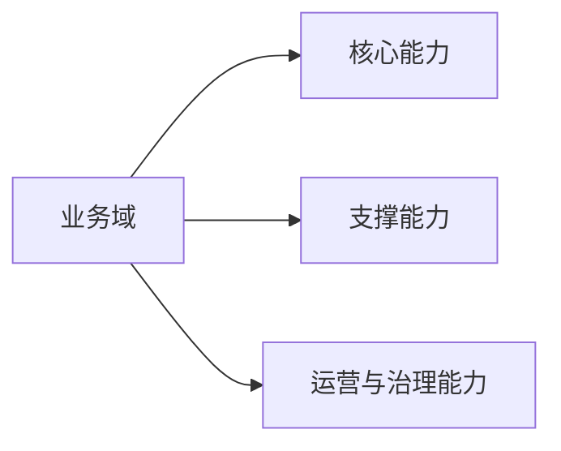
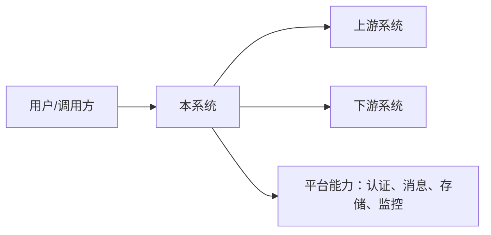
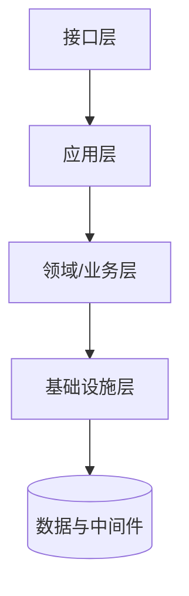
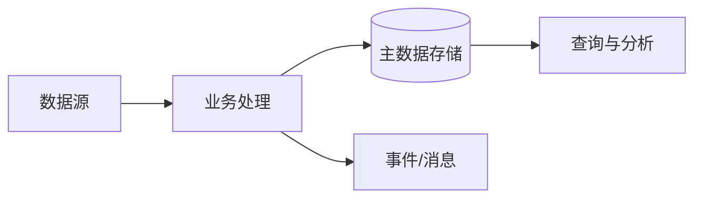

# [系统/项目名称] 概要架构设计

> 用途：确定系统边界、架构方向、关键技术决策和质量目标，作为详细设计、开发和架构评审的输入。
>
> 原则：描述“为什么这样设计”和“系统由什么组成”，不展开到字段级、类级和 SQL 级实现。

## 0. 文档控制

| 项目 | 内容 |
|---|---|
| 文档状态 | draft / in_review / approved / deprecated |
| 文档版本 | v[主版本].[次版本] |
| 文档负责人 |  |
| 架构评审人 |  |
| 关联需求/项目编号 |  |
| 目标上线版本 |  |
| 创建/更新时间 |  |
| 关联详细设计 | [链接] |

### 0.1 评审结论

状态：`pass` / `pass_with_followups` / `blocked`

| 项目 | 内容 |
|---|---|
| 已确认决策 |  |
| 阻塞问题 |  |
| 必须补充项 |  |
| 下次评审时间 |  |

### 0.2 变更记录

| 版本 | 日期 | 修改人 | 修改内容 | 评审结论 |
|---|---|---|---|---|
| v0.1 |  |  | 初稿 |  |

## 1. 执行摘要

### 1.1 背景与问题

[业务背景、现状痛点、建设动因。]

### 1.2 架构结论

- [结论 1：系统形态和核心架构模式]
- [结论 2：关键边界或数据所有权]
- [结论 3：高风险点及控制方式]

### 1.3 关键取舍

| 决策 | 选定方案 | 放弃方案 | 原因 | 复审条件 |
|---|---|---|---|---|
|  |  |  |  |  |

## 2. 项目概述与边界

### 2.1 目标与成功标准

| 目标 | 指标 | 目标值 | 验证方式 |
|---|---|---:|---|
|  |  |  |  |

### 2.2 范围

#### In Scope

- 

#### Out of Scope

- 

### 2.3 系统边界与术语

- 系统边界：
- 业务边界：
- 数据边界：
- 术语/缩写：
- 参考文档：

## 3. 架构原则、约束与质量属性

### 3.1 架构原则

| 原则 | 说明 | 影响 |
|---|---|---|
| API 优先 |  |  |
| 最小权限 |  |  |
| 可观测优先 |  |  |

### 3.2 约束与假设

| 类型 | 内容 | 来源/验证方式 |
|---|---|---|
| 业务约束 |  |  |
| 技术约束 |  |  |
| 合规约束 |  |  |
| 假设 |  |  |

### 3.3 质量属性场景

| 质量属性 | 场景 | 指标/目标值 | 基线来源 | 验证方式 |
|---|---|---:|---|---|
| 性能 |  | P95/P99、QPS/TPS | 历史监控数据 / 压测报告 / 业务SLA协议 / 行业基准 / 容量模型推算 | 压测 |
| 可用性 |  | SLA/SLO | 历史监控数据 / 业务SLA协议 / 行业基准 | 故障演练 |
| 可恢复性 |  | RPO/RTO | 业务SLA协议 / 行业基准 / 容量模型推算 | 恢复演练 |
| 安全 |  |  | 业务SLA协议 / 行业基准 | 安全测试 |
| 可扩展性 |  |  | 历史监控数据 / 容量模型推算 / 行业基准 | 容量验证 |

## 4. 整体业务与系统架构

### 4.1 业务能力地图

### 4.2 系统上下文与周边关系

### 4.3 租户、组织与地域边界

[说明多租户隔离、组织权限、地域/机房边界及数据驻留要求。]

## 5. 领域/业务架构

### 5.1 领域划分

| 领域/上下文 | 职责 | 核心对象 | 数据所有者 |
|---|---|---|---|
|  |  |  |  |

### 5.2 上下文映射与领域事件

[说明领域之间的依赖、事件发布方/订阅方和一致性边界。]

## 6. 逻辑架构

### 6.1 模块划分

| 模块编号 | 模块 | 职责 | 依赖 | 详细设计章节 |
|---|---|---|---|---|
| M-001 |  |  |  |  |

### 6.2 分层与依赖规则

### 6.3 复用、扩展、替换、新增分析

| 现有能力/模块 | 类型 | 处理方式 | 风险 |
|---|---|---|---|
|  | 复用/扩展/替换/新增 |  |  |

## 7. 数据架构（概要级）

### 7.1 数据分类与所有权

| 数据域 | 敏感等级 | 所有者 | 存储介质 | 保留期限 |
|---|---|---|---|---|
|  |  |  |  |  |

### 7.2 核心数据流

### 7.3 数据治理原则

- 数据质量、血缘、Schema 演进：
- 热冷分层、归档和清理：
- 备份、恢复、脱敏和访问审计：

> 表结构、索引、字段校验和迁移脚本放入《详细设计》。

## 8. 技术架构

| 层次 | 技术/组件 | 选型理由 | 备选 | License/供应链风险 |
|---|---|---|---|---|
| 运行时 |  |  |  |  |
| 数据库 |  |  |  |  |
| 缓存 |  |  |  |  |
| 消息 |  |  |  |  |
| 可观测 |  |  |  |  |

## 9. 部署与运行架构

### 9.1 网络、故障域与环境

[网络分区、入口、服务区、数据区、管理面、AZ/机房和环境规划。]

### 9.2 弹性、自愈与流量策略

- 扩缩容指标：
- 健康检查和自愈：
- 限流、负载均衡和连接池：
- 灰度、金丝雀和回滚：

### 9.3 CI/CD 总体策略

[分支、构建、扫描、部署、审批、回滚和配置管理原则。]

## 10. 横切架构

### 10.1 安全架构

- 身份认证与授权模型：
- 传输/存储加密：
- 敏感数据脱敏：
- 审计与合规：
- 威胁建模与防护边界：

### 10.2 可观测性

- 日志、指标、链路追踪统一规范：
- requestId/traceId 传播：
- 核心 SLI、告警和 Runbook：

### 10.3 高可用、容灾与灾备

| 故障场景 | 目标 RPO | 目标 RTO | 处置策略 | 演练频率 |
|---|---:|---:|---|---|
|  |  |  |  |  |

## 11. 核心逻辑（概要级）

### 11.1 关键业务流程

[只描述主要参与者、关键步骤、同步/异步边界。]

### 11.2 状态机与一致性边界

[列出状态、事件、状态转移和最终一致性策略。]

> 详细时序图、状态机 guard、事务边界和伪代码放入《详细设计》。

## 12. 依赖、风险、ADR 与演进

### 12.1 依赖清单

| 依赖 | 类型 | Owner | 版本/SLA | 影响 |
|---|---|---|---|---|
|  |  |  |  |  |

### 12.2 风险清单

| 风险 | 概率/影响 | 触发条件 | 应对 | Owner |
|---|---|---|---|---|
|  |  |  |  |  |

### 12.3 ADR 索引

| ADR | 决策主题 | 状态 | 复审时间 | 详细说明 |
|---|---|---|---|---|
| ADR-001 |  | accepted / superseded |  |  |

### 12.4 演进路线与技术债

| 阶段 | 目标 | 技术债/妥协 | 触发条件 | Owner |
|---|---|---|---|---|
| V1 |  |  |  |  |

## 13. 架构验收与详细设计准入

- [ ] 系统边界、模块职责和数据所有权已确认
- [ ] 质量属性已量化并有验证方式
- [ ] 安全、可观测、容灾责任人已明确
- [ ] 关键 ADR 已评审
- [ ] 详细设计范围和模块编号已冻结
- [ ] 外部接口/事件变更已决定是否生成 API diff

## 14. 开放问题与下一步

### Open Questions

1. 

### Assumptions

1. 

### Next Step

- [ ] 输出详细设计
- [ ] 输出 API diff / AsyncAPI
- [ ] 输出测试设计与容量验证方案
- [ ] 进入架构评审
